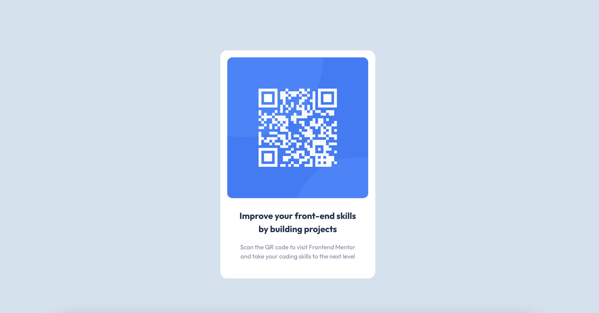

# Frontend Mentor - QR code component solution

This is a solution to the [QR code component challenge on Frontend Mentor](https://www.frontendmentor.io/challenges/qr-code-component-iux_sIO_H). Frontend Mentor challenges help you improve your coding skills by building realistic projects.

### Links

- Solution URL: https://github.com/nj93777/qr-code
- Live Site URL: [Add live site URL here](https://your-live-site-url.com)

- Semantic HTML5 markup
- CSS custom properties
- CSS Grid
- Mobile-first workflow
# qr-code
